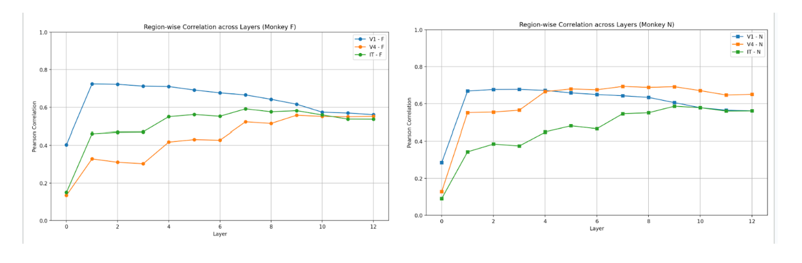

# 🧠 Brain Decoder with MUA and CLIP

This project explores how neural activity recorded from monkey brains (MUA signals) can be used to reconstruct visual scenes and evaluate how different brain regions encode visual information. It combines **encoding models**, **semantic decoding using CLIP**, and **image reconstruction using VDVAE + diffusion**.

---

## 📁 Files Included

- `NeuralDecoder_Report.pdf`: Final project report with methodology, analysis, and results
- `Part1-encoding_normalized MUA_AlexNet.ipynb`: Encoding model — maps AlexNet features to recorded MUA
- `Part2-decoding_normalized MUA_CLIP_vision.ipynb`: Decoding model — reconstructs image features from MUA using CLIP & VDVAE
- `images/`: Visualizations of core results

---

## 🧠 Method Overview

### 🔹 Part 1: Encoding MUA from AlexNet features

We trained encoding models to predict MUA responses from AlexNet layers. This helps understand which visual layers align with neural responses in different brain regions (V1, V4, IT).

- **Pearson correlation** is used to quantify prediction accuracy
- Higher correlation was observed in deeper AlexNet layers, especially for **IT cortex**, consistent with ventral stream hierarchy

### 🔹 Part 2: Decoding images from MUA using CLIP

We regressed MUA to **CLIP-vision embeddings**, then used a **VDVAE + Diffusion model** to generate realistic images.

- Evaluation metrics include:
  - **SSIM** (Structural Similarity)
  - **LPIPS** (Perceptual Distance)
  - **CLIP Similarity** (Cosine distance in CLIP space)

---

## 📊 Visualizations

### 🔸 1. Encoding Accuracy by Brain Region

  

  <em>Figure: Electrode-wise prediction accuracy (Pearson correlation) for Monkey F and N. IT shows highest alignment with deeper layers.</em>

---

### 🔸 2. Layer-wise Correlation (V1, V4, IT)

  

  <em>Figure: Region-wise correlation across all AlexNet layers. Correlation increases with depth, peaking in higher layers for IT.</em>

---

### 🔸 3. Image Reconstruction Comparison

  

  <em>Figure: Ground-truth images vs. reconstructions using (a) VDVAE, (b) VDVAE + CLIP-vision, and (c) CLIP-vision only.</em>

---

